# AliFi Search Engine 🚀

**AliFi** is a full-stack, intelligent web search engine built using Python and Flask.  
It integrates advanced natural language processing for semantic search, an in-house ad network, full user authentication, and an admin dashboard — all packed into a self-made ecosystem.

> 🕒 Developed in 4–5 days with over 14 hours of work per day.  
> 🧠 Total lines of code: 2200+ in a single Python file.  
> 📅 Project completed: August 2025

---

## 🌟 Features

### 🔍 Semantic Search (AI-Powered)
- Utilizes `SentenceTransformer` for vector-based semantic search.
- Accurately ranks pages using cosine similarity with your query.

### 📢 Built-in Ad Network
- Supports sponsored links with metadata.
- Ads displayed seamlessly within search results.

### 👥 User Authentication System
- Sign up, login, and password recovery system with secure credentials.
- Validates strong passwords and unique usernames/emails.

### 🛠️ Admin Panel
- Add or remove links manually.
- Add or remove users.
- View total and top searches.
- Manage reported URLs (delete/restore).

### 🧑‍💻 User Search Console
- Users can submit URLs to be indexed.
- Track submission status live.

### 🛡️ Report System
- Built-in link reporting tool.
- Admin review and moderation of flagged URLs.

### 💾 SQLite3 Backend
- Fast and efficient storage of URLs, users, ads, and search logs.

### 🧼 Clean, Responsive UI
- Mobile-friendly search interface.
- Inline HTML with custom styling (no external templates used).

---

## 🔧 Tech Stack

- **Backend**: Python 3, Flask
- **Frontend**: HTML5, CSS3 (inline styling)
- **Database**: SQLite3
- **NLP**: `sentence-transformers` (MiniLM model)
- **Libraries**: BeautifulSoup, Requests, Torch

---

## 📸 Screenshots

> Add screenshots of the homepage, search results, admin panel, and user console here.
> 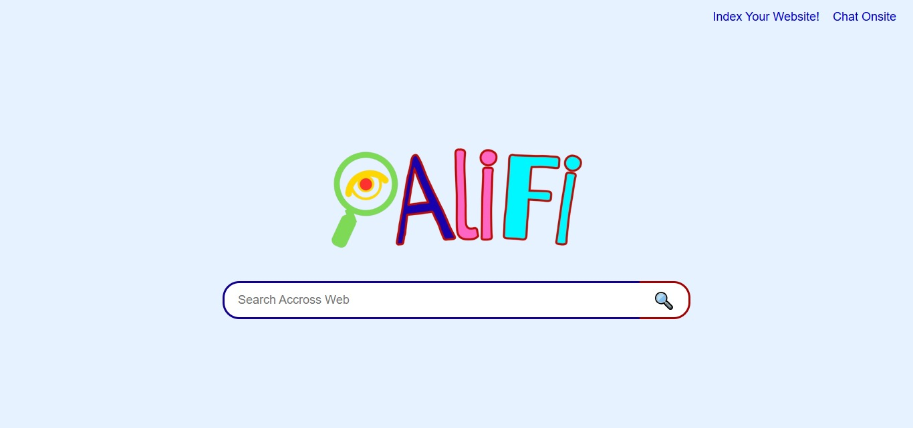
>
> 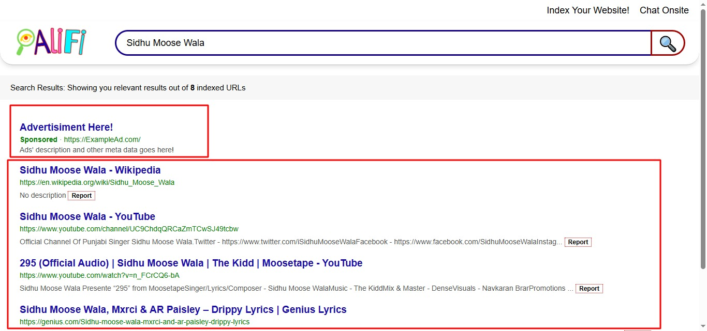
> 
> 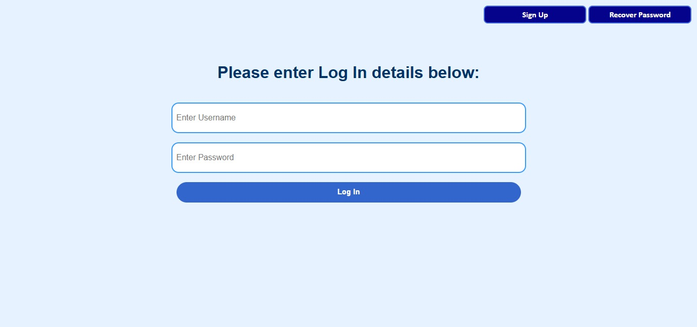
>
> 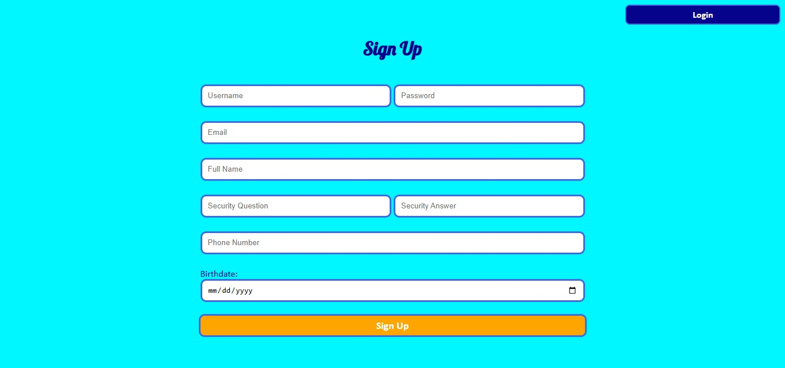
>
> 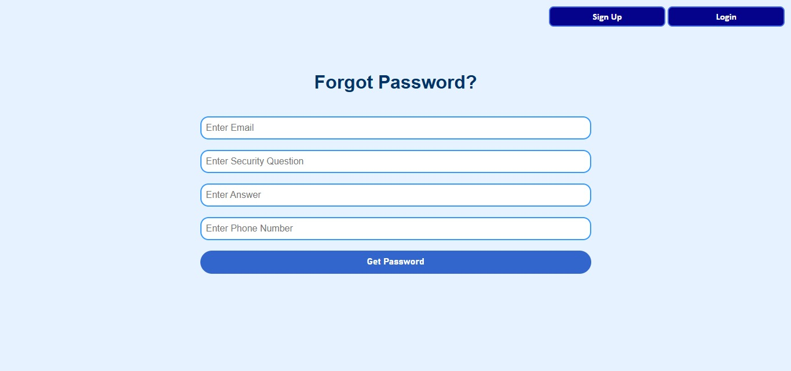
>
> 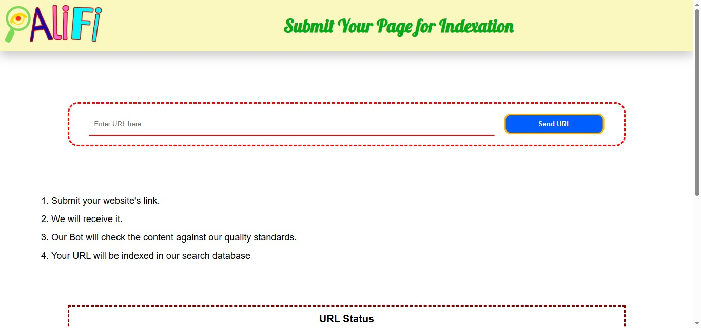
>
> 
>
> 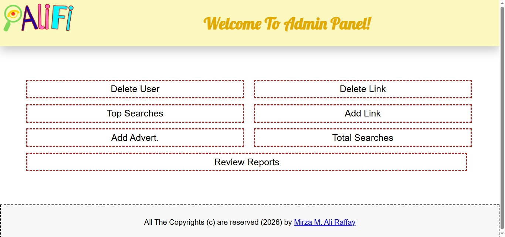
>
> 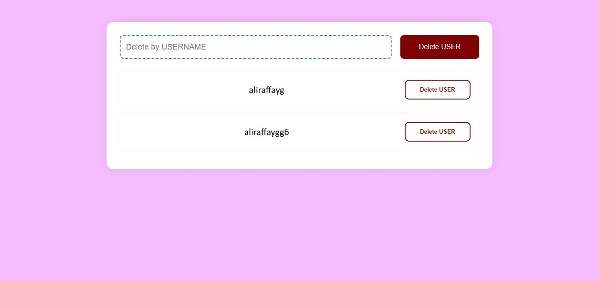
>
> 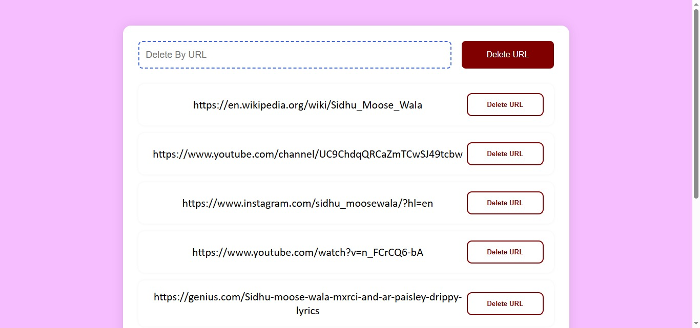
>
> 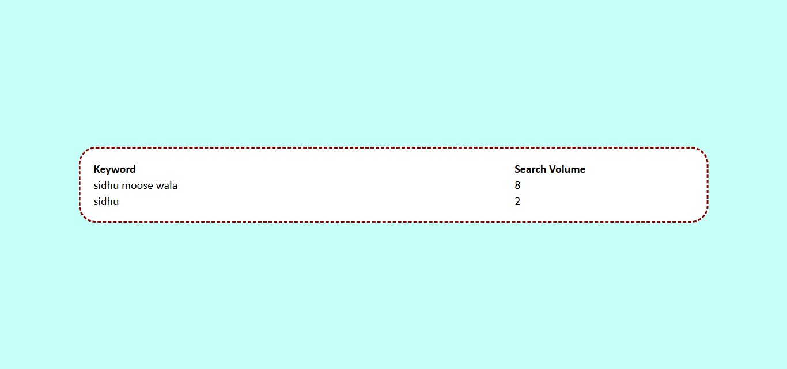
>
> 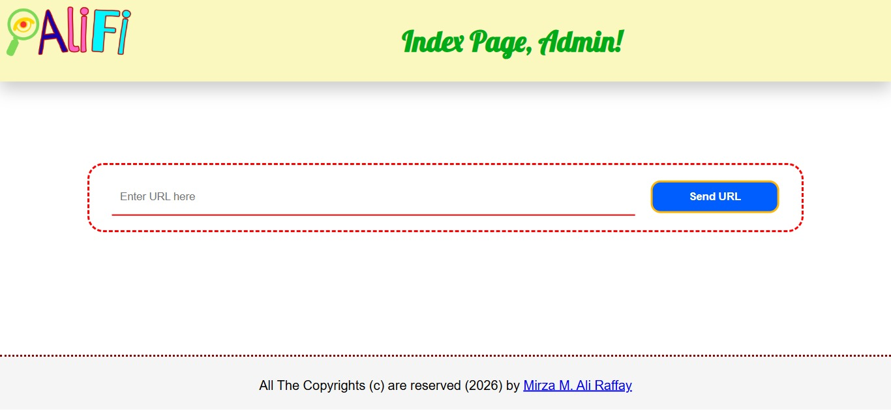
>
> 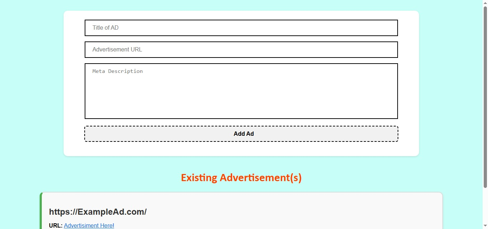
>
> 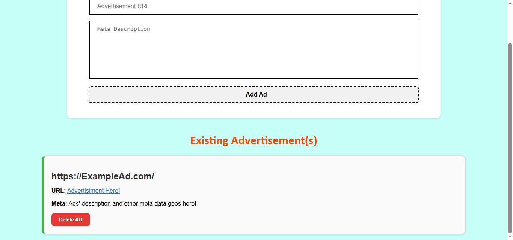
>
> 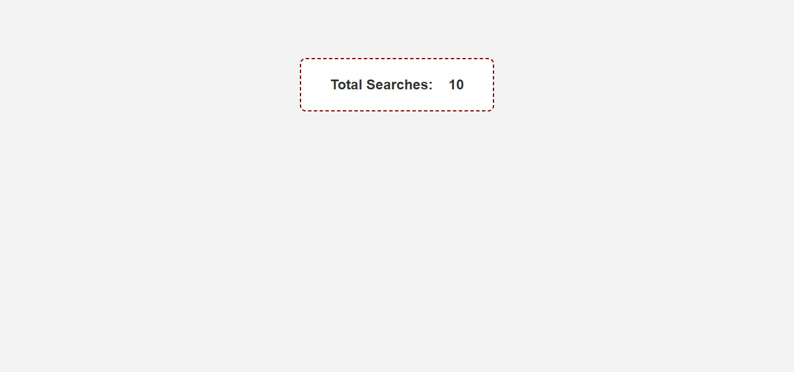
>
> 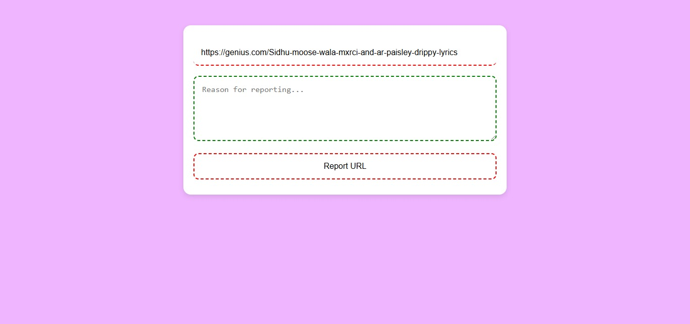
>
> 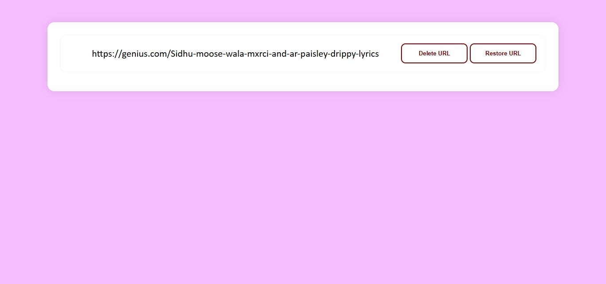
>
> 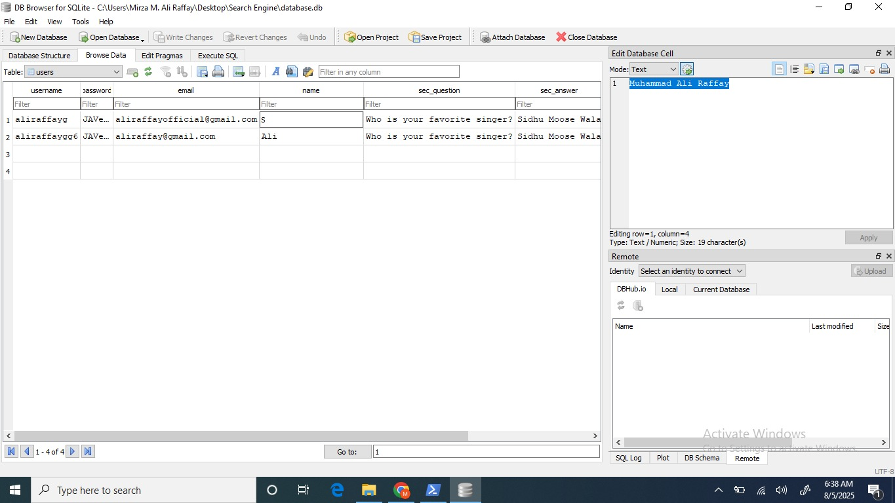
>
> 
>
> 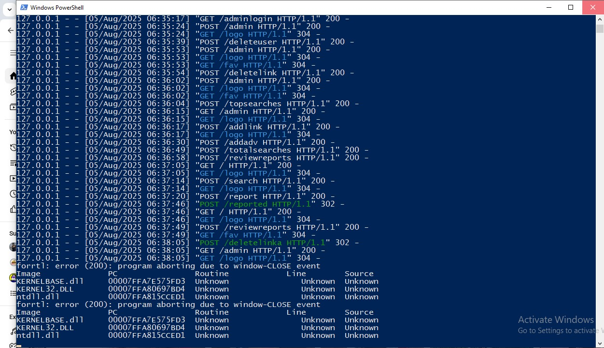
---

## 🧠 What I Learned

- How to build scalable Flask apps from scratch.
- Integrating NLP for intelligent search.
- Designing complete user management systems.
- Writing maintainable code, even in a single file.
- Working with session management and semantic scoring.

---

## 🗂️ Project Structure

Since this was a rapid development build, the codebase is structured in a single Python file: `app1.py`.  
You’ll also find:
- `ads.txt` – Ad database
- `database.db` – SQLite3 file (auto-created)
- `/html/static/logo.PNG`, `/fav.PNG` – Static assets

---

## 🚀 Getting Started

1. Clone this repo or download the `.py` file.
2. Ensure Python 3.8+ is installed.
3. Install dependencies:

```bash
pip install flask requests beautifulsoup4 sentence-transformers torch
```

4. Run the server:

```bash
python app.py
```

5. Navigate to `http://127.0.0.1:5000/` in your browser.

---

## 🙏 Acknowledgments

- Built as a self-driven project without any formal university support — purely passion and persistence.

---

## 📜 License

This project is free to use and learn from. Commercial use of the design or branding requires permission.

---

**Made with ❤️ by Mirza M. Ali Raffay**  
[GitHub Profile](https://github.com/MAliRaffayMirza)

